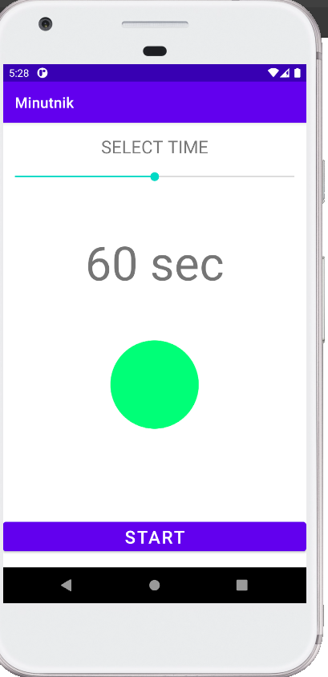
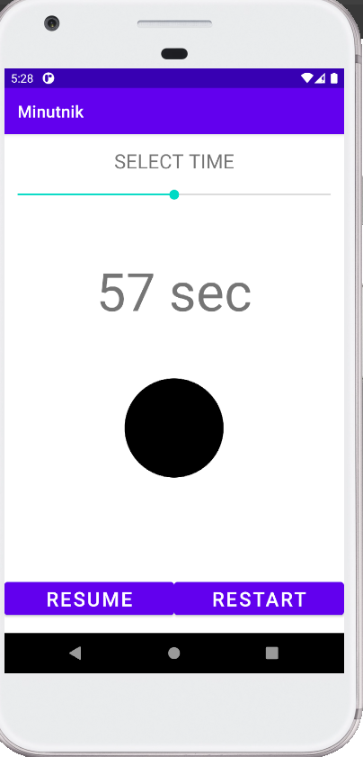
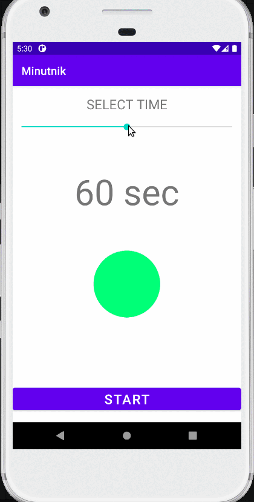

# Minutnik
Simple counter down app.
Sounds from https://www.freesoundslibrary.com/

<h3>User can:</h3>

- set time to count down from 0 to 120 seconds,
- stop, resume and restart counter,

<h3>Used technologies:</h3>

- kotlin,
- seekbar,
- CountDownTimer,
- MediaPlaye for playins sound when count down reaches zero and on tick,
- finding views from layout with view binding.

<h3>App secreenshots:</h3>

Initial app screen           |  Resume restart screen
:-------------------------:|:-------------------------:
  |   

<h3>App during usage:</h3>
 

